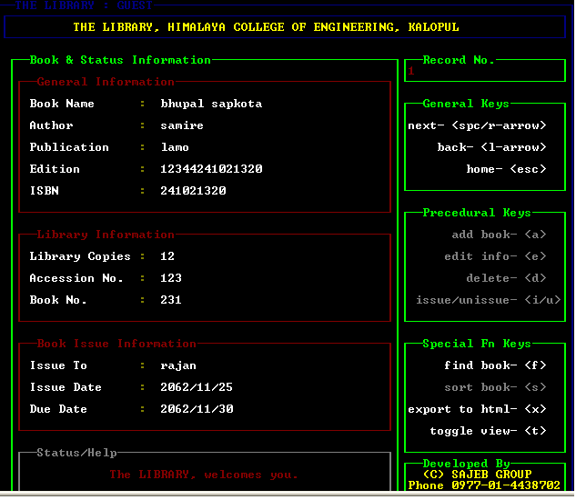

Simple Library Management System
---------------------------------

Platform: C 

Features:
- Library Books/Student records Management 
- Nice UI
- No Graphics Functions used / only ASCII characters 
- File Handling (needs some work out.. forgot how it worked at that time)
- Save Books Record in File and Export the result in HTML format. 

Notes:
- this project was done in fulfilment of course requirement of our I Year/ I Semester Computer Engineering study.

Cheers!
Twitter: @bhu1st

